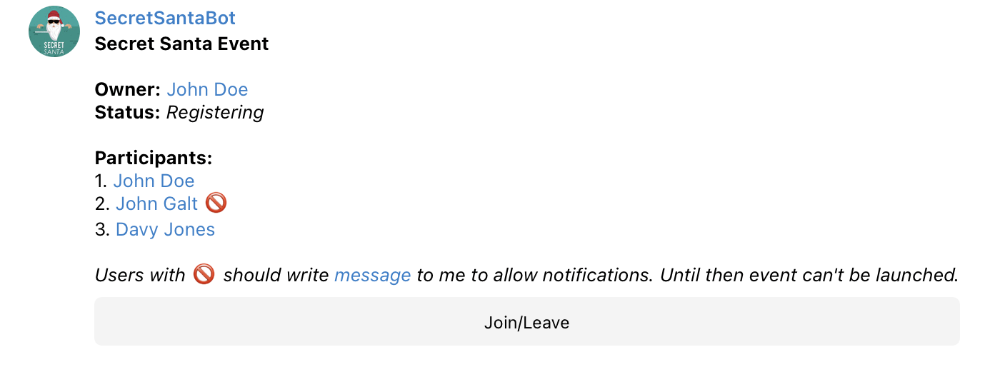
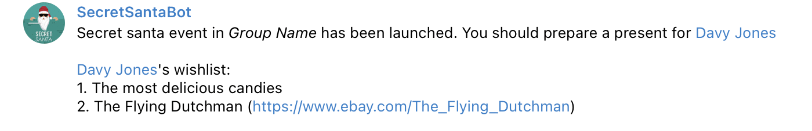

# Secret Santa Bot

[](https://app.travis-ci.com/vhapiak/secret_santa_bot) [](https://coveralls.io/github/vhapiak/secret_santa_bot?branch=master)

_Secret Santa Bot_ allows you to create new year events, where each participant will receive present from the Secret Santa (from one of the another participant).

## Installation and build

Bot is written using typescript, so we need to compile source code into java script.

```
npm install
npm run build
```

## Launching

```
npm run bot <name> <token> <db-path>
# <name> - Telegram bot name
# <token> - Telegram bot token
# <db-path> - Path to directory with bot database. Can be path to any empty directory.
```

## Features

### Registering

Telegram users can register to event using corresponding button in group message.



### Wishlists

Each participant can send a wishlist to bot (in private chat). This list will be visible for Secret Santa who preparing present for this participant (see screenshots below).

### Secret Santa targets

When owner launches event each participant will receive a person (for whom he/she should prepare a present) and a wishlist (if any).



### Wishlist update notifications

If your target will change a wishlist, you will receive corresponding notification.


